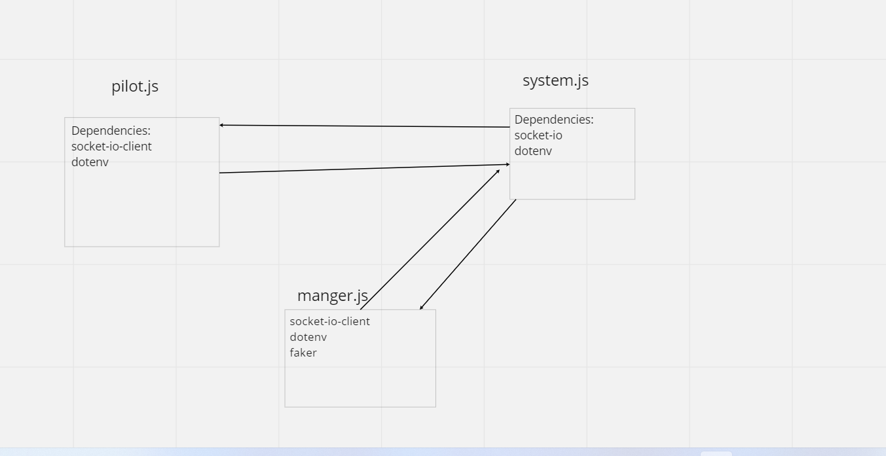

# airline-system
to build a control system for an Airline (for example Royal Jordanian Airlines) where you will keep tracking each flight status by contacting the pilot of that flight who in turn will inform the manager and the system when a flight took-off and arrived.

We have three main components in this system:

* Manager (starting point)
* Pilot (taking actions)
* System (logging details)

## UML Diagram 

### Featutess added by class 13
Creating message queue to store the events when the pilot is offline and send them back when he became online.